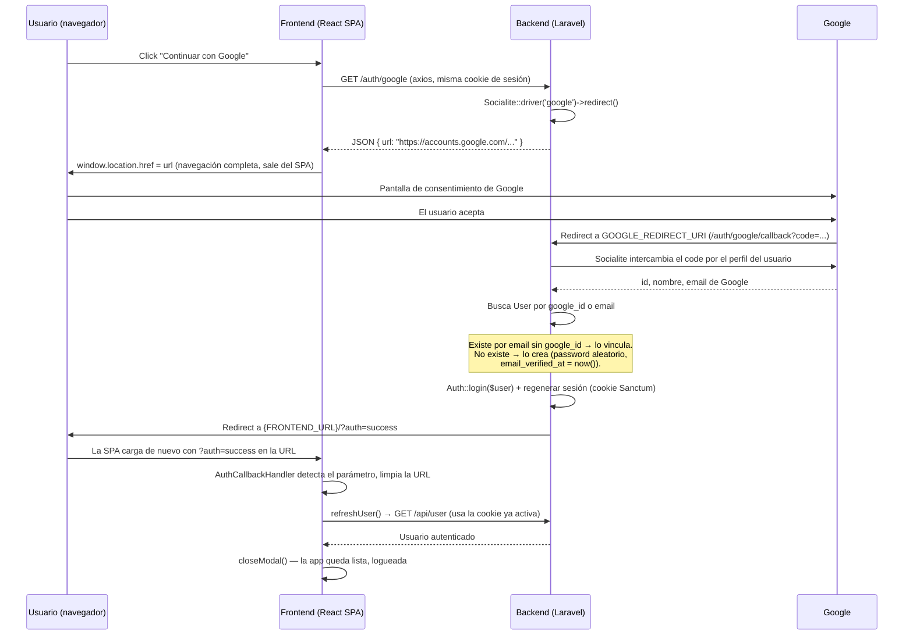

# 023 — Modal de autenticación + Google OAuth

## Resumen

Las páginas `/login` y `/register` dejan de ser pantallas completas y pasan a ser un modal
(`AuthModal.tsx`) accesible desde cualquier punto de la app — header, drawer móvil, rutas
protegidas, y los distintos prompts de "inicia sesión para X" que ya existían repartidos por el
proyecto. Se añade "Continuar con Google" vía Laravel Socialite. La sesión sigue siendo
100% Sanctum SPA (cookie httpOnly) — Google solo crea o vincula el `User`, después el flujo de
sesión es idéntico al de email/password.

---

## Archivos creados

| Archivo | Descripción |
|---------|-------------|
| `app/Http/Controllers/SocialAuthController.php` | `redirectToGoogle()` (devuelve la URL de Google en JSON) y `handleGoogleCallback()` (busca/vincula/crea el usuario, inicia sesión, redirige al frontend) |
| `database/migrations/2026_08_13_092127_add_google_id_to_users_table.php` | Columna `google_id` (nullable, unique, después de `email`) |
| `tests/Feature/SocialAuthTest.php` | Reproduce la petición del callback tal y como la envía Google (Socialite mockeado, sin Origin/Referer de localhost) — ver "Bug post-implementación" más abajo |
| `src/components/AuthModal.tsx` | El modal: overlay con blur, tabs, formularios de login/registro, botón de Google |
| `src/context/AuthModalContext.tsx` | Estado global del modal — `isOpen`, `defaultTab`, `openModal()`, `closeModal()`, hook `useAuthModal()` |

## Archivos modificados

| Archivo | Cambio |
|---------|--------|
| `config/services.php` | Bloque `google` (`client_id`, `client_secret`, `redirect`) |
| `config/app.php` | Nueva key `frontend_url` — usada para construir el redirect de vuelta al SPA |
| `app/Models/User.php` | `google_id` añadido a `$fillable` |
| `routes/web.php` | `GET /auth/google` y `GET /auth/google/callback` — **no** en `api.php`, ver más abajo por qué |
| `docker/nginx.conf` | `location ~ ^/(api\|sanctum\|auth)(/.*)?$` — añadido `auth` para que esas dos rutas lleguen al backend |
| `.env` | `GOOGLE_REDIRECT_URI` → `http://localhost/auth/google/callback` (ya no lleva `/api`) |
| `src/context/AuthContext.tsx` | Nuevo método `refreshUser()` — no existía; hace falta porque la sesión de Google se crea en el backend sin pasar por `login()`/`register()` |
| `src/App.tsx` | `AuthModalProvider`, montaje único de `<AuthModal />`, `AuthCallbackHandler` (detecta `?auth=success`) |
| `src/pages/LoginPage.tsx` / `RegisterPage.tsx` | Pasan de página completa a shim: abren el modal en el tab correspondiente y redirigen a `/` |
| `src/components/Layout.tsx` | Enlaces de header → `openModal()`; `handleLogout` navega a `/` en vez de `/login` |
| `src/components/MobileDrawer.tsx` | Enlaces del drawer → `openModal()` |
| `src/components/ProtectedRoute.tsx` | Sin sesión: abre el modal y redirige a `/` (antes: `<Navigate to="/login">`) |
| `src/components/LandingProductCard.tsx` | Su mini-modal propio de "inicia sesión para favoritos" se elimina — usa `openModal('login')` |
| `src/pages/MapaTroncodriloPage.tsx` | Su prompt de "inicia sesión para subir tu fanfic" se elimina — usa `openModal('login')` |
| `src/pages/BolaTroncodriloPage.tsx` | El enlace `Inicia sesión` del panel de compartir pasa a `openModal('login')` |

**Sin tocar**: `app/Http/Controllers/AuthController.php` (login/register/logout/user por
email+contraseña — verificado con la suite `AuthTest`, sigue en verde), `src/components/CartDrawer.tsx`
(no tiene ningún check de auth, no necesitaba cambios).

---

## Flujo completo de Google OAuth



Puntos clave de la implementación:

- **`GET /auth/google` nunca redirige directamente** — el frontend es una SPA y necesita la
  URL como dato (JSON) para poder hacer `window.location.href = url` él mismo. `Socialite::driver('google')->redirect()->getTargetUrl()` genera la URL de Google **y** guarda el
  parámetro `state` (protección CSRF de OAuth) en la sesión activa, sin enviar ninguna respuesta
  HTTP de redirección.
- **Por qué no hace falta CORS especial para el callback**: Google redirige el navegador
  directamente a `/auth/google/callback` — es una navegación completa de primer nivel, no una
  petición `fetch`/`axios` desde el origen del frontend, así que no pasa por el middleware CORS.
- **Por qué estas dos rutas viven en `web.php` y no en `api.php`** — ver la sección "Bug
  post-implementación" más abajo; es la parte no obvia de todo el flujo.
- **Por qué la cookie de sesión sobrevive el viaje de ida y vuelta a Google**: la cookie de sesión
  de Laravel es `SameSite=Lax` por defecto, y `Lax` sí se envía en navegaciones GET de nivel
  superior iniciadas por un sitio externo (que es exactamente este caso) — solo bloquea peticiones
  "no seguras" (POST, fetch, etc.) entre sitios.
- **La contraseña aleatoria** (`Hash::make(Str::random(32))`) existe solo para satisfacer la
  columna `password NOT NULL` — un usuario creado por Google nunca la usa; siempre entra por el
  botón de Google (o restablece su contraseña más adelante, fuera del alcance de esta feature).

---

## Cómo configurar credenciales de Google OAuth

Necesario si se despliega en otro dominio, se rota el secreto, o se clona el proyecto:

1. Ir a [Google Cloud Console](https://console.cloud.google.com/) → crear o seleccionar un
   proyecto.
2. **APIs y servicios → Pantalla de consentimiento OAuth**: configurar tipo "Externo", nombre de
   la app, correo de soporte. En desarrollo, añadir el email de prueba en "Usuarios de prueba" si
   la app queda en modo "Testing".
3. **APIs y servicios → Credenciales → Crear credenciales → ID de cliente de OAuth**:
   - Tipo de aplicación: **Aplicación web**.
   - **Orígenes autorizados de JavaScript**: `http://localhost` (o el dominio de producción).
   - **URIs de redireccionamiento autorizados**: debe coincidir **exactamente** con
     `GOOGLE_REDIRECT_URI` — `http://localhost/auth/google/callback` en desarrollo (sin `/api`,
     ver "Bug post-implementación").
4. Copiar el **Client ID** y el **Client secret** generados.
5. Pegarlos en `src/backend/.env` (ver variables abajo) y `php artisan config:clear` si el config
   estaba cacheado.

### Variables de entorno necesarias

| Variable | Dónde se usa | Ejemplo |
|----------|--------------|---------|
| `GOOGLE_CLIENT_ID` | `config/services.php` → `services.google.client_id` | `123...apps.googleusercontent.com` |
| `GOOGLE_CLIENT_SECRET` | `config/services.php` → `services.google.client_secret` | `GOCSPX-...` |
| `GOOGLE_REDIRECT_URI` | `config/services.php` → `services.google.redirect` | `http://localhost/auth/google/callback` |
| `FRONTEND_URL` | `config/app.php` → `app.frontend_url`, destino del redirect final | `http://localhost` |

Las cuatro deben coincidir entre sí y con lo configurado en Google Cloud Console — un
`GOOGLE_REDIRECT_URI` que no esté en la lista de "URIs de redireccionamiento autorizados" de
Google produce `redirect_uri_mismatch` en la pantalla de consentimiento.

---

## Cómo añadir otro proveedor OAuth (GitHub, Apple, etc.) en el futuro

El patrón es el mismo para cualquier proveedor que soporte Socialite:

1. **GitHub, GitLab, Bitbucket, LinkedIn, etc.** — ya vienen incluidos en `laravel/socialite`, no
   hace falta instalar nada más.
   **Apple** requiere el paquete adicional `socialiteproviders/apple` (Socialite no lo trae por
   defecto porque el flujo de Apple firma la respuesta con JWT en vez de un simple `code`).

2. Registrar la app en el proveedor (GitHub: *Settings → Developer settings → OAuth Apps*; Apple:
   *Apple Developer → Certificates, Identifiers & Profiles*) y obtener client id/secret.

3. Añadir el bloque en `config/services.php`, mismo patrón que `google`:
   ```php
   'github' => [
       'client_id'     => env('GITHUB_CLIENT_ID'),
       'client_secret' => env('GITHUB_CLIENT_SECRET'),
       'redirect'      => env('GITHUB_REDIRECT_URI'),
   ],
   ```

4. Añadir dos métodos a `SocialAuthController` (o generalizar con un parámetro `$provider` si se
   añaden varios a la vez — con uno o dos proveedores más, mantenerlos explícitos como
   `redirectToGoogle`/`redirectToGithub` sigue siendo más legible que generalizar prematuramente):
   ```php
   public function redirectToGithub(): JsonResponse
   {
       return response()->json(['url' => Socialite::driver('github')->redirect()->getTargetUrl()]);
   }

   public function handleGithubCallback(Request $request): RedirectResponse
   {
       // misma lógica de buscar-por-provider_id-o-email que handleGoogleCallback(),
       // pero probablemente conviene una columna github_id independiente de google_id
       // (un mismo email puede llegar por cualquiera de los dos proveedores).
   }
   ```

5. Migración: una columna `github_id` (nullable, unique) — no reutilizar `google_id` para otro
   proveedor.

6. Rutas públicas en `api.php`, junto a las de Google.

7. Frontend: un botón más en `AuthModal.tsx`, mismo patrón que el de Google (`GET
   /api/auth/{provider}` → `window.location.href = data.url`), con el logo SVG del proveedor.

---

## Decisiones técnicas

### 1. `refreshUser()` no existía en `AuthContext` — se añadió
La tarea 7 del encargo original asumía que ya existía. El contexto solo tenía `login`, `register`,
`logout` y el fetch inicial en el `useEffect` de montaje — ninguno servía para releer al usuario
tras una sesión creada del lado del backend sin pasar por el frontend (justo el caso de Google).

### 2. `z-[80]` en vez de `z-50` para el overlay
El header ya usa `z-50`, y los modales existentes del proyecto (`ShippingAddressModal`,
`FanficUploadModal`) usan `z-[60]`/`z-[70]` para quedar por encima de él. `z-[80]` sigue esa misma
escala y garantiza que el modal de auth quede siempre por encima de cualquier otra cosa que pueda
estar abierta (drawer, carrito, otro modal).

### 3. `text-secondary`/`bg-secondary/10` en vez de `text-red-600` para errores
El encargo pedía `text-red-600` (así están hoy los formularios de `LoginPage`/`RegisterPage`
originales), pero los componentes creados después del rediseño editorial (feature 017) —
`ShippingAddressModal`, `CartDrawer`, `FanficUploadModal` — usan el marrón de marca
(`--color-secondary`) para todos los estados de error. Se siguió esa segunda convención por ser la
vigente para código nuevo.

### 4. `AuthModal` dividido en contenedor + contenido (`AuthModalContent`)
El componente está siempre montado (para poder animar apertura/cierre sin perder el punto de
montaje), pero el formulario necesita arrancar limpio cada vez que se abre. La primera versión
reseteaba los campos a mano dentro de un `useEffect`, lo que `eslint-plugin-react-hooks` (v7)
señala como anti-patrón (`set-state-in-effect`, cascada de renders innecesaria). Se resolvió
separando el contenido del formulario en un componente hijo que solo se monta mientras
`isOpen === true` — al desmontarse/montarse de verdad en cada apertura, el estado nace limpio sin
ningún efecto de sincronización.

### 5. `LandingProductCard.tsx`, `MapaTroncodriloPage.tsx` y `BolaTroncodriloPage.tsx` — tres
puntos de entrada más, encontrados con grep
El encargo original listaba `Layout`, `MobileDrawer`, `ProtectedRoute`, `LandingProductCard` y
sugería revisar `CartDrawer`. Un grep de `/login`/`/register` en todo `src/frontend/src` encontró
dos sitios adicionales con el mismo patrón de "prompt de login" inline
(`MapaTroncodriloPage.tsx`, `BolaTroncodriloPage.tsx`) y confirmó que `CartDrawer.tsx` no tiene
ningún check de autenticación — no necesitaba cambios.

### 6. `config('app.frontend_url')` en vez de hardcodear la URL de retorno
`FRONTEND_URL` ya estaba en `.env` pero no se usaba en ningún sitio del backend. Se expuso como
`config('app.frontend_url')` (una entrada más en `config/app.php`, mismo patrón que `app.url`) en
vez de escribir `http://localhost` directamente en `SocialAuthController`.

### 7. Verificación con Playwright vía `npx` — `chromium-cli` no estaba disponible
El entorno no tenía `chromium-cli` instalado. Se usó `npx playwright` directamente (el binario de
Chromium ya estaba cacheado en el sistema salvo por un desfase de versión, resuelto con
`npx playwright install chromium`) con un script ad-hoc que navega la app real servida por
Docker/Nginx en `http://localhost`, hace click en los flujos reales (abrir modal, cambiar de tab,
cerrar por backdrop/X, click en "Continuar con Google", `/login`, `/perfil` sin sesión,
`?auth=success`) y compara capturas de pantalla y estado del DOM contra lo esperado — no solo
`tsc`/`eslint` estáticos. El script vive fuera del repo (carpeta temporal de la sesión), no se ha
commiteado. **Lo que ese script no pudo probar**: el tramo final del callback real de Google, que
requiere completar un login con una cuenta real — precisamente donde apareció el bug de la
siguiente sección.

---

## Bug post-implementación: `Session store not set on request.`

Al probar con una cuenta real, `handleGoogleCallback()` lanzaba
`RuntimeException: Session store not set on request.`.

**Causa raíz**: las rutas de Google vivían en `api.php`, cuyo grupo de middleware solo obtiene
sesión cuando `Laravel\Sanctum\Http\Middleware\EnsureFrontendRequestsAreStateful::fromFrontend()`
devuelve `true` — y esa función mira el header `Origin` (o `Referer` si no hay `Origin`) y compara
su dominio contra `SANCTUM_STATEFUL_DOMAINS`. El callback de Google llega como una navegación GET
normal iniciada por `accounts.google.com`, sin ningún header que apunte a `localhost`, así que
`fromFrontend()` devuelve `false`, ninguna sesión se inyecta, y tanto `Auth::login()` (el guard
`web` escribe en sesión) como el `$request->session()->regenerate()` explícito revientan. El
propio proyecto ya documentaba este mecanismo antes de esta feature —
`tests/Feature/AuthTest.php::fromBrowser()` añade el header `Origin` a mano en cada test
precisamente por esto.

**Por qué `->stateless()` solo, sin mover las rutas, no basta** — se verificó de forma empírica,
no solo por lectura de código: `tests/Feature/SocialAuthTest.php` reproduce la petición exacta que
manda Google (mismo verbo, misma ausencia de `Origin`/`Referer`, con Socialite mockeado para no
depender de credenciales reales) y sirvió para probarlo en ambas direcciones:

1. Contra el código original (rutas en `api.php`, sin `stateless()`) → el test falla con el mismo
   `Session store not set on request.` en la misma línea, reproduciendo el bug reportado.
2. Añadiendo `->stateless()` a `redirect()` y a `user()` **sin mover las rutas** → el test sigue
   fallando, con el **mismo** error y la **misma** línea. `stateless()` solo evita que *Socialite*
   toque la sesión al validar el `state` CSRF — no tiene ningún efecto sobre `Auth::login()` ni
   sobre el `$request->session()->regenerate()` explícito del controller, que son los que de
   verdad revientan. Además, `stateless()` de verdad (sin sesión en ningún punto) sería
   incompatible con el requisito explícito de esta feature: el login de Google tiene que acabar en
   una sesión Sanctum real, igual que email/password.

**Fix aplicado — mover las dos rutas a `web.php`** (routes/web.php, docker/nginx.conf,
`GOOGLE_REDIRECT_URI`, `AuthModal.tsx`; ver tabla de archivos modificados arriba). El grupo `web`
tiene sesión disponible siempre, sin la condición de `Origin`/`Referer` — es lo que de verdad
soluciona el problema de raíz, no solo el síntoma de Socialite. Confirmado con
`tests/Feature/SocialAuthTest.php` en verde (ambas direcciones) y con una petición `curl` real
contra el stack en marcha (`GET http://localhost/auth/google` → `200` con la URL de Google y el
`redirect_uri` correcto).

### ⚠️ Paso manual pendiente — Google Cloud Console

El código ya construye y sirve la URL de Google con
`redirect_uri=http://localhost/auth/google/callback` (verificado con Playwright contra el stack
real), pero Google la rechaza con `redirect_uri_mismatch` porque el proyecto de Google Cloud
Console todavía tiene registrada la URI **antigua** (`.../api/auth/google/callback`) en "URIs de
redirección autorizados". Esto no es algo que se pueda arreglar desde el código — hace falta
entrar a [Google Cloud Console](https://console.cloud.google.com/) → **APIs y servicios →
Credenciales** → el cliente OAuth de este proyecto → sustituir
`http://localhost/api/auth/google/callback` por `http://localhost/auth/google/callback` en "URIs
de redireccionamiento autorizados" → Guardar. Sin ese cambio, un login real con Google seguirá
fallando aunque el resto del flujo esté correcto.

---

## Cómo probar manualmente

1. **Abrir el modal**: click en "Iniciar sesión" en el header → modal centrado, fondo
   difuminado (`backdrop-filter: blur(8px)`) y oscurecido.
2. **Cambiar de tab**: click en "Registrarse" → el contenido cambia con fade de 150ms, aparecen
   los 4 campos (Nombre, Email, Contraseña, Confirmar contraseña).
3. **Cerrar**: click fuera del modal (backdrop) → cierra. Reabrir y click en la X → también
   cierra.
4. **Login por email**: con un usuario existente, rellenar y enviar → el modal se cierra y el
   header pasa a mostrar el nombre del usuario.
5. **Registro por email**: nombre/email/contraseña nuevos → cuenta creada, modal cerrado, sesión
   iniciada.
6. **Google**: click en "Continuar con Google" → el navegador sale de la app y aterriza en la
   pantalla de login de Google con el `client_id` y `redirect_uri` correctos. Tras aceptar,
   vuelve a `http://localhost/` ya logueado, y el usuario aparece en la tabla `users` con
   `google_id` relleno.
7. **`/perfil` sin sesión**: `ProtectedRoute` redirige a `/` con el modal abierto (ya no existe
   una página `/login` que se muestre por sí sola).
8. **`/login` y `/register` por URL directa**: ambas rebotan a `/` con el modal abierto en el tab
   correspondiente.
9. **Móvil (~375px)**: el modal ocupa prácticamente todo el ancho de la pantalla.
10. `php artisan test` — sin fallos nuevos frente a lo que había antes de esta feature.
